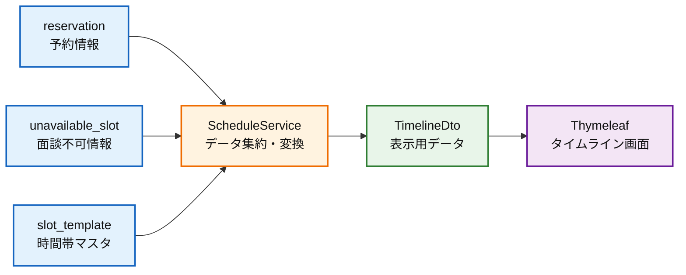
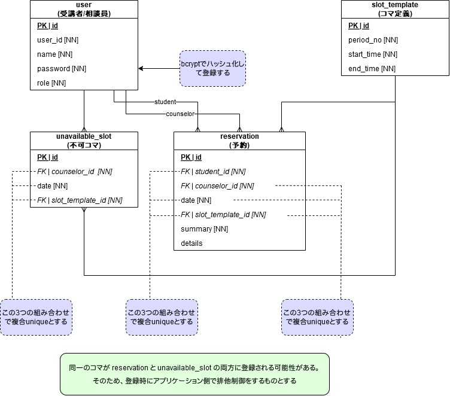

# 面談予約システム

## 概要

訓練校における受講者と相談員の面談予約を支援するWebアプリケーションです。

受講者は空いている面談枠を確認し予約できます。<br>
相談員は予約状況の確認や、会議・授業などによる面談不可枠の管理を行えます。

本システムはポートフォリオとして、要件定義から設計・実装までの一連の開発プロセスを意識して作成しています。<br>
また、経路上のパスワードの暗号化を目的として、自己署名証明書を利用しています。<br>
詳細は[自己署名証明書について](#自己署名証明書について)をご参照ください。

---

## 背景

私の通っている訓練校では、キャリアカウンセラーに相談をする際、紙面上で面談予約を行っています。そのため現状、以下の課題があります。

- 予約作業に手間がかかる
- 予約状況が把握しづらい

これらの課題を解決するため、本システムを開発しました。

---

## 起動方法

### 1. MariaDBを起動
MariaDBを起動してください。
接続情報は以下を想定しています。

- User: root
- Password: password

アプリケーション起動時に
counseling-reservation-system-db が存在しない場合は
自動的に作成されます。

### 2. HTTPS証明書を配置

証明書を生成し、src/main/resources 配下へ配置してください。
```bash
keytool -genkeypair \
  -alias tomcat \
  -keyalg RSA \
  -keysize 2048 \
  -storetype PKCS12 \
  -keystore keystore.p12 \
  -storepass password \
  -validity 3650 \
  -ext SAN=IP:{アプリを実行するサーバーのIPアドレス}
```
証明書を信頼済みとして登録していない環境からアクセスした場合、ブラウザにセキュリティ警告が表示される場合があります。<br>
必要に応じて生成した証明書をクライアントPCへ登録してください。<br>

### 3. Spring Boot起動

```bash
mvnw spring-boot:run
```
### 4. アクセス
同一ネットワーク内のクライアントPCから、
```
https://サーバーIPアドレス:8443
```
でアクセスできます。

## 主な機能

### ログイン
<br>
ログインIDに紐づけられたRoleに応じて、受講生ページ、相談員ページに遷移します。

### 受講生ページ
#### 予約状況タイムライン
##### 面談可能枠の確認
<br>
受講生IDでログインした場合、受講生タイムラインページに遷移します。ここでは、直感的な表示で予約状況の確認･実際の予約が可能です。<br>
相談員が予定などで面談不可として登録しているコマには、画像のように面談不可として表示され、クリックができないようにしています。<br>
また、既に他の受講者によって予約されているコマも、予約済みと表示され、クリックができないようになっています。
##### 面談予約
<br>
タイムラインから予約可能コマをクリックすると予約申し込みモーダルが開き、実際に予約することができます。<br><br>
<br>
予約に成功すると、画像のように最上部に完了通知が表示されます。<br><br>
<br>
すでに同時間帯の別な相談員に予約している状態で予約しようとした場合（画像の例:相談員2の11:00のコマ）、画像のようなエラー表示が出て予約を拒否します。<br>これにより、同一受講者による同一時間帯の重複予約を防止しています。<br>
この機能は、DBの複合ユニーク制約によって実現しています。<br>

詳細は[同一時間帯の重複予約防止 (DBによる整合性保証)](#同一時間帯の重複予約防止dbによる整合性保証)を参照してください。

##### 自身の予約確認
<br>
タイムライン上のご予約コマをクリックすると、自身の予約内容の確認、予約キャンセルができます。<br><br>
#### 予約一覧
<br>
予約タイムライン画面から予約一覧ボタンをクリックすると、面談予約一覧ページに遷移し、自分の今後の面談予約を一覧できます。

### 相談員ページ
#### 予約状況タイムライン
<br>
相談員IDでログインした場合、相談員タイムラインページに遷移します。このページでは、自身に対する予約状況の確認、面談不可枠の設定が可能です。
#### 面談不可枠の登録・解除
タイムライン上の(不可にする)ボタンや(解除する)ボタンをクリックすることで、その枠の面談の可不可を切り変えることができます。
#### 面談内容の確認
<br>
タイムライン上で詳細確認ボタンをクリックすると、予約内容の詳細を確認するモーダルが表示されます。

---

## 工夫した点
### 同一時間帯の重複予約防止(DBによる整合性保証)
受講者が同じ時間帯に複数の相談員へ予約できないようにする必要がありました。<br>

この制約をアプリケーションのみで保証する場合、実装変更や想定外の経路からの登録によってデータの整合性が崩れる可能性があります。<br>

そのため、DBの複合ユニーク制約を利用し、業務ルールそのものをDBで保証する設計としました。<br>

これを実現するため、reservation テーブルに<br>
```
(student_id, date, slot_template_id)
```
の複合ユニーク制約を設定しました。<br>
これによりDBレベルで整合性を保証しています。<br>

その他の部分に関しても、アプリケーションだけでなくDBレベルでの整合性を保証するため、複合ユニーク制約を使用しています。<br>
詳細は[E-R図](#e-r図)をご参照ください。

### 予約枠を事前生成しない設計

当初は slotテーブルにStatus:Emptyという形で枠を事前生成し、実際に予約された時にStatus:Reservedに置き換える案を検討しました。<br>
しかし、
- 相談員ごとの大量データ生成が必要
- どのタイミングでデータを生成するかなど、管理処理が複雑になる<br>

と判断し、予約データと面談不可データから空き枠を動的に計算する方式へ変更しました。<br>

詳細は[DB設計について](#db設計について)を参照してください。

### バックエンドのデータ形式と画面表示用データ形式の分離

タイムライン画面では、

- 予約可能枠
- 自分の予約
- 他者の予約
- 面談不可

といった状態を1つの一覧として表示する必要があります。

一方、DBでは

- reservation
- unavailable_slot
- slot_template (1コマが何時から何時までかという情報を持ったテーブル)

など、責務ごとにテーブルを分けて管理しています。

そのため Entity をそのまま画面へ渡すのではなく、画面表示専用の TimelineDto を作成し、サービス層で複数テーブルの情報を集約・変換し、フロントエンドに渡す設計としました。

これにより、

- DB設計と画面仕様を分離できる
- UI変更の影響をDB設計へ波及させない
- 表示ロジックをサービス層へ集約できる

というメリットが得られました。




## 苦労した点
### タイムラインの動的生成
上記の事前生成しない仕様の影響で、DB上の複数のテーブルの情報を統合して、フロントエンド用のTimelineDtoに変換する必要がありました。<br>
この処理が当初の想定より煩雑なものとなってしまい、コードの可読性が落ちてしまいました。

## 今後改善したい点
* JUnitを用いたテスト実装
* Dockerによる完全な実行環境構築
    * 将来的には Docker compose コマンドで、DBの起動からアプリケーションのビルド、https証明書の生成などの起動前準備を自動化できるようにしたいと考えています。
* 実行時設定の外部化
    * DB接続情報や証明書パスワードなどを環境変数から取得するよう改善したいと考えています。
* 管理者画面の実装
    * 新規ユーザーの登録は、resources/sql/user.sqlを編集しアプリを再起動するか、DBに直接登録する形になっていますが、これらの作業を行える管理者用の画面を実装したいと考えています。

## システム仕様

### 面談枠

面談はあらかじめ定義されたコマ単位で管理します。

例

- 1限 09:00～10:00
- 2限 10:00～11:00
- 3限 11:00～12:00
- 4限 13:00～14:00

### 予約ルール

- 他の受講生によって予約済みのコマは予約不可
- 面談不可コマは予約不可
- 既に同時間帯に別の相談員に予約している場合予約不可
  
その他仕様に関する詳細は [要件定義書](./docs/要件定義書.md) をご覧ください。

### 動作確認用アカウント
今回動作確認用として、以下のアカウントを事前登録するものとします。

| ユーザーID | パスワード | 権限 |
|-----------|-----------|------|
| st01 | test1234  | 受講者 |
| st02 | test1234  | 受講者 |
| st03 | test1234  | 受講者 |
| c01 | test1234  | 相談員 |
| c02 | test1234  | 相談員 |

以上のアカウントは、初回起動時に自動で生成されます。

---

## 技術スタック
- Java 21
- Spring Boot
- Spring Security
- Spring Data JPA
- Thymeleaf
- MariaDB
- Maven

## E-R図


---

## 備考
### 自己署名証明書について
本システムではHTTPSによる暗号化を実装するため、自己署名証明書を使用するものとしました。<br>

自己署名証明書では認証局による証明が行われないため、第三者による真正性の保証ができません。<br>
しかし、本システムは学習目的で開発するものであり、実運用時も訓練校のイントラネット内での限定的な環境での利用を想定しています。そのため、利用者のPCにあらかじめ証明書を配布し信頼済み証明書として登録することで、運用上必要なレベルの安全性を確保できると判断しました。<br>
以上の理由から、本システムでは通信経路の暗号化による盗聴防止を主目的とし、自己署名証明書を採用することとしました。<br>

本番運用を想定する場合、改めて認証局が発行する証明書に置き換えて運用するものとします。

### DB設計について
当初は、以下のように slot テーブルを設け、あらかじめ相談員ごとの空きコマを生成しておく設計を検討していました。<br><br>
slot
* id
* counselor_id
* date
* slot_template_id
* status 
    * 初期値:empty

予約が行われた際に status を reserved に更新することで、予約済み状態を管理する想定でした。

しかし、この方式では相談員ごとに一定期間先までのコマをあらかじめ生成する仕組みが必要となります。また、予約の有無にかかわらず事前に大量の空きコマを保持することになるため、設計および運用が複雑になる懸念がありました。

そのため、現在は空きコマを事前生成せず、予約されたコマは reservation テーブル、相談員都合で利用不可とするコマは unavailable_slot テーブルで管理する設計を採用しています。

一方で、この設計には「同一のコマが reservation と unavailable_slot の両方に登録される可能性がある」という課題があります。この点については、アプリ側で登録時に整合性チェックを行い、同一コマが両テーブルに重複して登録されないよう制御する方針としています。
* 面談不可登録時、対象コマに予約が存在する場合は登録できないものとする。
* 予約登録時、対象コマに面談不可登録が存在する場合は登録できないものとする。

---

## 設計資料

- [要件定義書](./docs/要件定義書.md)
- [画面遷移図](./docs/画面設計/画面遷移図.jpg)
- [ワイヤーフレーム](./docs/画面設計/ワイヤーフレーム)

