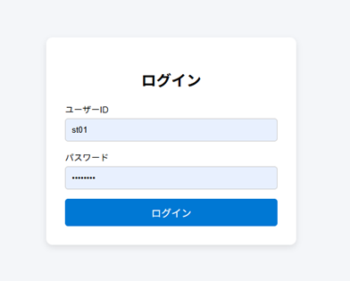
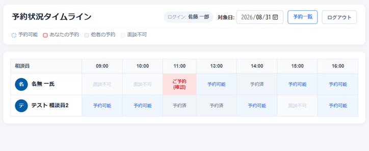
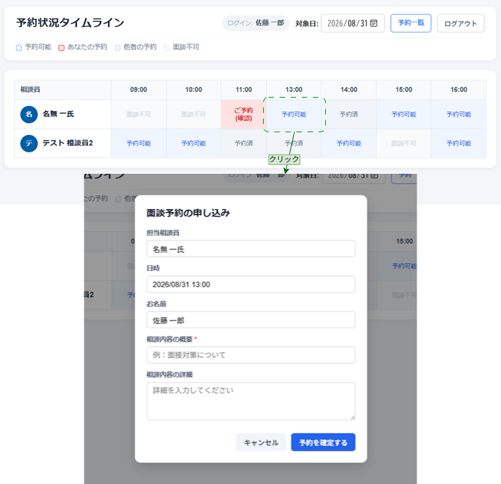
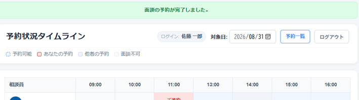
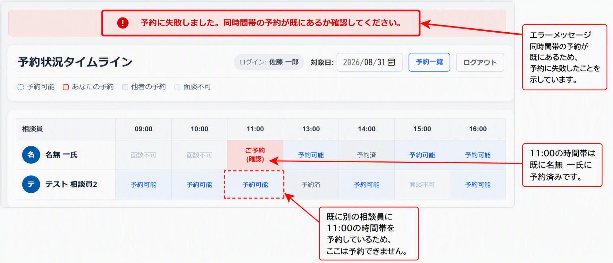
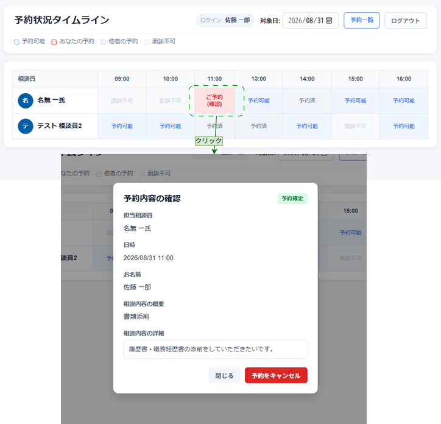
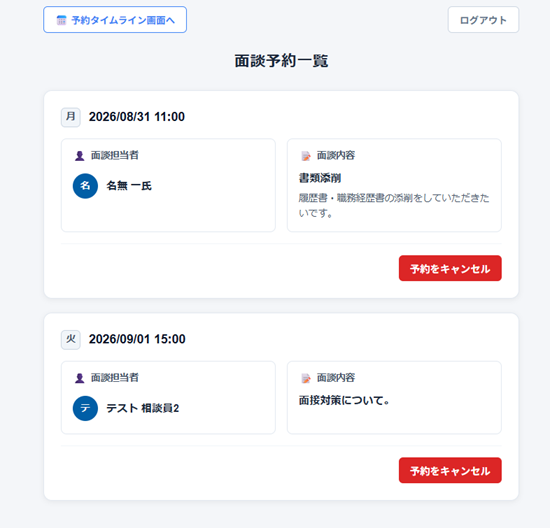
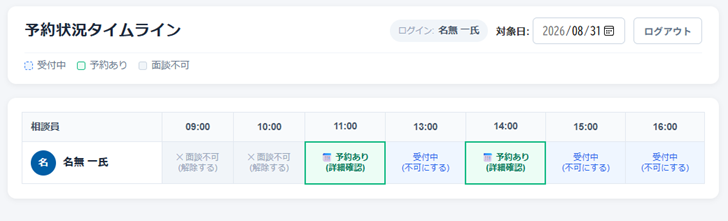
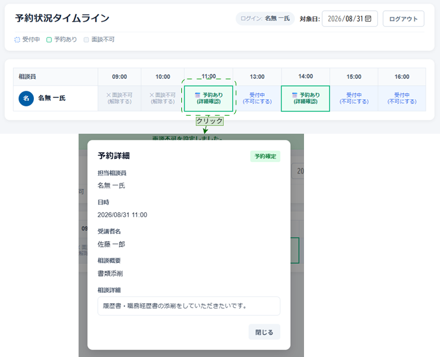

# 面談予約システム

## 概要

訓練校における受講者と相談員の面談予約を支援するWebアプリケーションです。

受講者は空いている面談枠を確認し予約できます。<br>
相談員は予約状況の確認や、会議・授業などによる面談不可枠の管理を行えます。

本システムはポートフォリオとして、要件定義から設計・実装までの一連の開発プロセスを意識して作成しています。

---

## 背景

私の通っている訓練校では、キャリアコンサルタントに相談をする際、紙面上で面談予約を行っています。そのため現状、以下の課題があります。

- 空き時間の確認に手間がかかる
- 予約状況が把握しづらい

これらの課題を解決するため、本システムを開発しました。

---

## 起動方法

### 1. MariaDBを起動
MariaDBを起動してください。
接続情報は以下を想定しています。

- Database: counseling-reservation-system-db
- User: root
- Password: password
### 2. HTTPS証明書を配置

証明書を生成し、src/main/resources 配下へ配置してください。
```bash
keytool -genkeypair \
  -alias tomcat \
  -keyalg RSA \
  -keysize 2048 \
  -storetype PKCS12 \
  -keystore keystore.p12 \
  -storepass password \
  -validity 3650 \
  -ext SAN=IP:{アプリを実行するサーバーのIPアドレス},DNS:localhost
```
証明書を信頼済みとして登録していない環境からアクセスした場合、ブラウザにセキュリティ警告が表示される場合があります。<br>
必要に応じて生成した証明書をクライアントPCへ登録してください。<br>

### 3. Spring Boot起動

```bash
mvn spring-boot:run
```
### 4. アクセス
同一ネットワーク内のクライアントPCから、
```
https://サーバーIPアドレス:8443
```
でアクセスできます。

## 主な機能

### ログイン
<br>
ログインIDに紐づけられたRoleに応じて、受講生ページ、相談員ページに遷移します。

### 受講生ページ
#### 予約状況タイムライン
##### 面談可能枠の確認
<br>
受講生IDでログインした場合、タイムラインページに遷移します。ここでは、直感的な表示で予約状況の確認が可能です。
##### 面談予約
<br>
タイムラインから予約可能コマをクリックすると予約申し込みモーダルが開き、実際に予約することができます。<br><br>
<br>
予約に成功すると、画像のように最上部に完了通知が表示されます。<br><br>
<br>
すでに同時間帯の別な相談員に予約している状態で予約しようとした場合（画像の例:相談員2の11:00のコマ）、画像のようなエラー表示が出て予約処理は失敗します。<br>これにより、同一受講者による同一時間帯の重複予約を防止しています。<br>
##### 自身の予約確認
<br>
タイムライン上のご予約コマをクリックすると、自身の予約内容の確認、予約キャンセルができます。<br><br>
#### 予約一覧
<br>
予約タイムライン画面から予約一覧ボタンをクリックすると、面談予約一覧ページに遷移し、自分の今後の面談予約を一覧できます。

### 相談員ページ
#### 予約状況タイムライン
<br>
相談員IDでログインした場合、相談員タイムラインページに遷移します。このページでは、自身に対する予約状況の確認、面談不可枠の設定が可能です。
#### 面談不可枠の登録・解除
タイムライン上の(不可にする)ボタンや(解除する)ボタンをクリックすることで、その枠の面談の可不可を切り変えることができます。
#### 面談内容の確認
<br>
タイムライン上で詳細確認ボタンをクリックすると、予約内容の詳細を確認するモーダルが表示されます。

---

## 工夫した点
### 同一時間帯の重複予約防止 (DBによる整合性保証)
受講者が同じ時間帯に複数の相談員へ予約できないようにする必要がありました。<br>
アプリケーションのみで重複予約を判定する場合、同時アクセス時に整合性が崩れる可能性があります。<br>
そのため最終的にはDBの複合ユニーク制約を利用し、データ整合性をDBで保証する設計としました。<br>
これを実現するため、reservation テーブルに<br>
```
(student_id, date, slot_template_id)
```
の複合ユニーク制約を設定しました。<br>
これによりDBレベルで整合性を保証しています。
### 予約枠を事前生成しない設計

当初は slotテーブルにStatus:Emptyという形で枠を事前生成し、実際に予約された時にStatusをReservedに置き換える案を検討しました。<br>
しかし、
- 相談員ごとの大量データ生成が必要
- どのタイミングでデータを生成するかなど、管理処理が複雑になる<br>

と判断し、予約データと面談不可データから空き枠を動的に計算する方式へ変更しました。

## 苦労した点
### タイムラインの動的生成
上記の事前生成しない仕様の影響で、予約データと面談不可データからタイムラインを動的に生成する処理を書くことになりましたが、事前の予想以上に煩雑な処理となり、可読性が落ちてしまいました。

## 今後改善したい点
* JUnitを用いたテスト実装
* Dockerによる完全な実行環境構築
    * 将来的には Docker compose コマンドで、DBの起動からhttps証明書の生成などの起動前準備を自動化できるようにしたいと考えています。
* 実行時設定の外部化
    * DB接続情報や証明書パスワードなどを環境変数から取得するよう改善したいと考えています。
* 管理者画面の実装
    * 新規ユーザーの登録は、resources/sql/user.sqlを編集しアプリを再起動するか、DBに直接登録する形になっていますが、これらの作業を行える管理者用の画面を実装したいと考えています。

## システム仕様

### 面談枠

面談はあらかじめ定義されたコマ単位で管理します。

例

- 1限 09:00～10:00
- 2限 10:00～11:00
- 3限 11:00～12:00
- 4限 13:00～14:00

### 予約ルール

- 他の受講生によって予約済みのコマは予約不可
- 面談不可コマは予約不可
- 既に同時間帯に別の相談員に予約している場合予約不可
  
その他仕様に関する詳細は [要件定義書](./docs/要件定義書.md) をご覧ください。

### 動作確認用アカウント
今回動作確認用として、以下のアカウントを事前登録するものとします。

| ユーザーID | パスワード | 権限 |
|-----------|-----------|------|
| st01 | test1234  | 受講者 |
| st02 | test1234  | 受講者 |
| st03 | test1234  | 受講者 |
| c01 | test1234  | 相談員 |
| c02 | test1234  | 相談員 |

以上のアカウントは、初回起動時に自動で生成されます。

---

## 技術スタック
- Java
- Spring Boot
- Spring Security
- Spring Data JPA
- Thymeleaf
- MariaDB
- Maven

## HTTPSについて
通信経路の暗号化を目的としてHTTPSを導入しています。<br>
学習用途・ポートフォリオ用途であるため、証明書には自己署名証明書を利用しています。<br>
本番運用では、認証局(CA)が発行した証明書への変更を想定しています。

---

## 設計資料

### 要件定義

- [要件定義書](./docs/要件定義書.md)
- [画面遷移図](./docs/画面設計/画面遷移図.jpg)
- [ワイヤーフレーム](./docs/画面設計/ワイヤーフレーム)

### DB設計

- [E-R図](./docs/E-R図.jpg)
